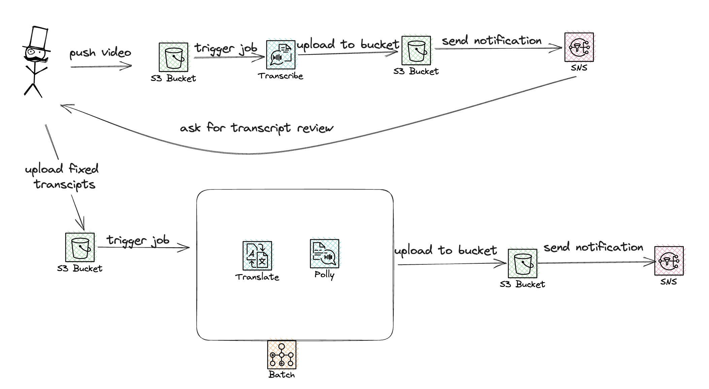

# AWS Community Day Warsaw

## Architecture



## Useful commands

* `npm run build`   compile typescript to js
* `npm run watch`   watch for changes and compile
* `npm run test`    perform the jest unit tests
* `cdk deploy`      deploy this stack to your default AWS account/region
* `cdk diff`        compare deployed stack with current state
* `cdk synth`       emits the synthesized CloudFormation template

### Run testign docker

```bash
docker run -it --rm  \
    --env INVIDEO=s3://initial-videos/video.mp4 \
    --env INSUBTITLES=s3://transcribed-after-review/transcribe_1373f66d31115381_video.mp4.json \
    --env OUTBUCKET=final-videos \
    --env OUTLANG="es de" \
    --env REGION=eu-central-1 \
    test:latest
```

## Credits

Rob Dachowski author of [blog post](https://aws.amazon.com/blogs/machine-learning/create-video-subtitles-with-translation-using-machine-learning/)
